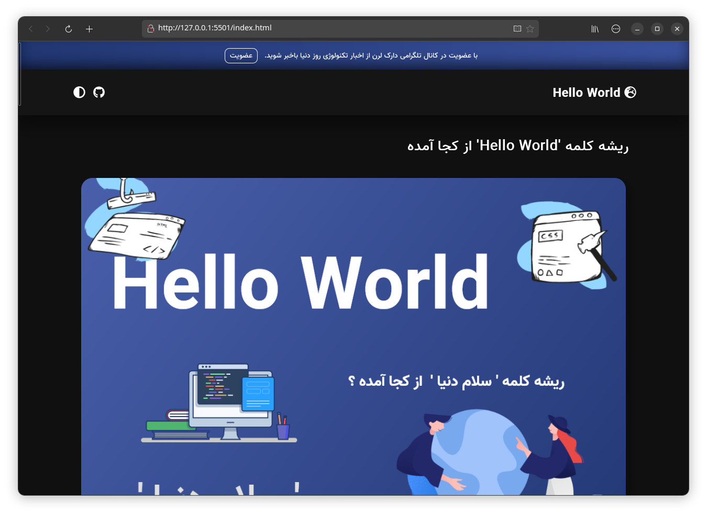
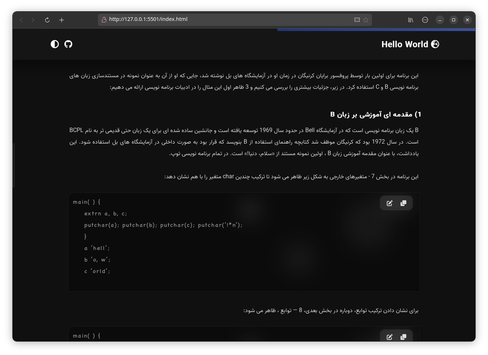
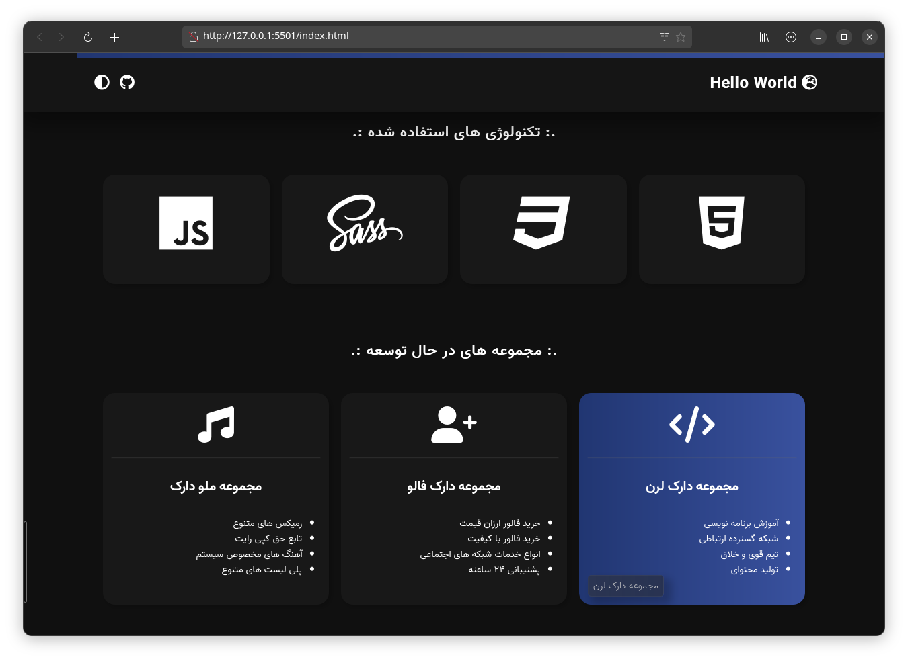

 
  

    
🌍 en

    <h1>📛 Hello World 📛</h1>
    
A slang word that is printed as a project test when creating a project 🖥️ 📗

    
🔮 Have you ever noticed the mystery of this word? 

    
Before reading this article, the word 'hello world' may have been a common word for you, but it gets scary when we think about it. 🪤

    <ul>
      <li>Why do you think such a word is used? 👁️‍🗨️</li>
      <li>Could this be a clue to the future of robots? 🤖 🪦 </li>
      <li>What do you think about this? 💭</li>
    </ul> 
    <h4>🤝 participation</h4>
      
This project is released and maintained under the GPL version 3 license, and in this sense, anyone can contribute to modify or improve or even add new features to this project, as well as create different forks of the project and develop the project in A separate branch, whether free or commercial, has no obstacles

  

        
  

    
🌍 fa

    <h1>📛 سلام جهان 📛</h1>
    
یک کلمه عامیانه که به عنوان تست پروژه هنگام ایجاد پروژه چاپ می شود 🖥️ 📗

    
آیا تا به حال به رمز و راز این کلمه توجه کرده اید ؟ 🔮

    
قبل از خواندن این مقاله، ممکن است کلمه 'سلام دنیا' برای شما یک کلمه رایج بوده باشد، اما وقتی به آن کمی فکر می کنیم ترسناک می شود. 🪤

    <ul dir="rtl">
      <li>فکر می کنید چرا از چنین کلمه ای استفاده می شود؟ 👁️‍🗨️</li>
      <li>آیا این می تواند سرنخی برای آینده روبات ها باشد؟ 🤖 🪦</li>
      <li>چه فکری در این باره دارید؟ 💭 </li>
    </ul> 
    <h4 dir="rtl">🤝 مشارکت</h4>
    
این پروژه تحت پروانه GPL نسخه 3 منتشر و نگه‌داری می‌شود و از این‌جهت، هرکسی می‌تواند در صورت نیاز اقدام به مشارکت برای اصلاح یا بهبود یا حتی اضافه کردن ویژگی های جدید به این پروژه کند، همچنین ایجاد فورک های مختلف از پروژه و توسعه پروژه در شاخه‌ای جدا، چه به‌صورت رایگان و چه به‌صورت تجاری، هیچگونه مانعی ندارد

  

    

  

        
Toggle Dark Preaview
 
        
        
        
  

  

        
Toggle Lignt Preaview
 
        
        
        
  

