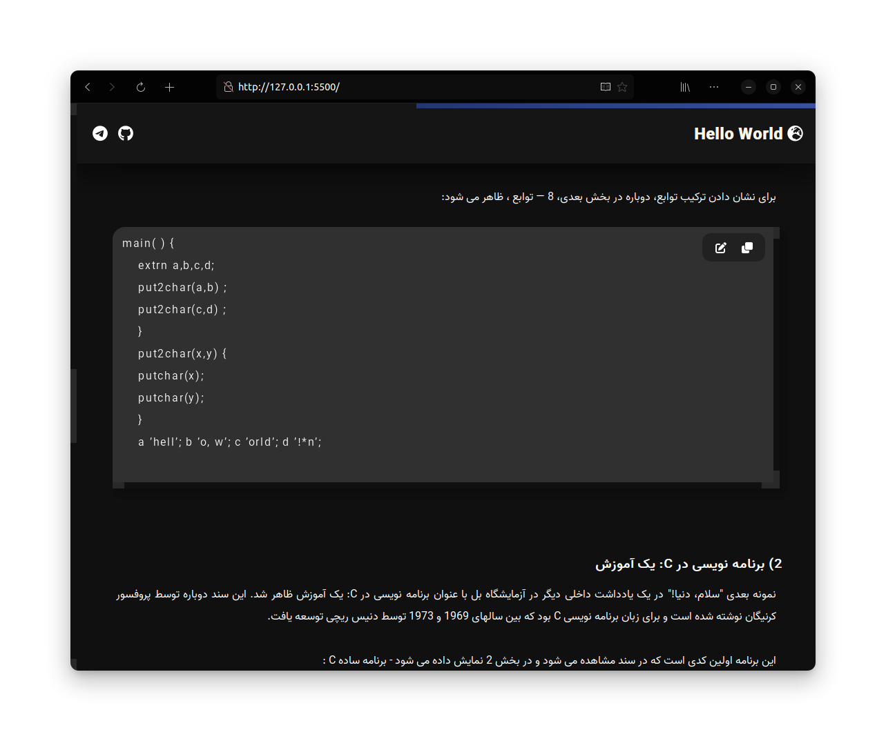

🌍 en
### 📛 Hello World 📛

A slang word that is printed as a project test when creating a project 🖥️ 📗

🔮 Have you ever noticed the mystery of this word? 

Before reading this article, the word 'hello world' may have been a common word for you, but it gets scary when we think about it. 🪤

-- Why do you think such a word is used? 👁️‍🗨️  
-- Could this be a clue to the future of robots? 🤖 🪦  
-- What do you think about this? 💭  

 
 
🌍 fa
### 📛 سلام دنیا 📛

یک کلمه عامیانه که به عنوان تست پروژه هنگام ایجاد پروژه چاپ می شود 🖥️ 📗

آیا تا به حال به رمز و راز این کلمه توجه کرده اید ؟ 🔮

قبل از خواندن این مقاله، ممکن است کلمه 'سلام دنیا' برای شما یک کلمه رایج بوده باشد، اما وقتی به آن کمی فکر می کنیم ترسناک می شود. 🪤

-- فکر می کنید چرا از چنین کلمه ای استفاده می شود؟ 👁️‍🗨️  
-- آیا این می تواند سرنخی برای آینده روبات ها باشد؟ 🤖 🪦  
-- چه فکری در این باره دارید؟ 💭  

    

